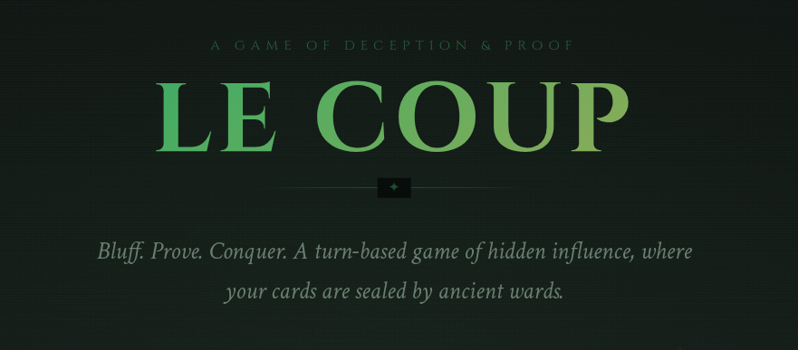

A cryptographic rethink of the classic "Coup" board game, built for the **Stellar Hacks: ZK Gaming** hackathon. 

Le Coup leverages **Zero-Knowledge Proofs (ZKPs)** and **Stellar Protocol 25 (X-Ray)** to create a trustless, on-chain environment where players can bluff about their hidden cards, and the contract can verify the truth through cryptographic host functions.

## 🚀 Vision
In traditional digital card games, the server knows everything. In Le Coup:
- Players maintain **Self-Custody** of their hidden cards through local state.
- **ZK Proofs** allow you to prove "I have the Lion card" without revealing your other influence.
- **Protocol 25 (X-Ray)** host functions verify these proofs on-chain during disputes, ensuring honesty without sacrificing privacy.

## 🛠️ Tech Stack
- **Smart Contract:** Soroban (Rust) with [Protocol 25](https://stellar.org/blog/developers/stellar-protocol-25-x-ray) BN254 host functions.
- **ZK Circuits:** Circom (Groth16 on BN254).
- **Proving Engine:** `snarkjs` (Browser-side proving).
- **Frontend:** React + Vite + Tailwind CSS.
- **Identity:** `SmartAccountKit` (Passkey-based Smart Wallets).

## 💎 Features
- **ZK Action Proofs:** Prove possession of cards for `Tax`, `Steal`, `Exchange`, and `Reveal` actions.
- **Dispute Resolution:** Triggered on-chain when a player challenges a bluff.
- **ZK Audit Pack:** A post-game terminal that reveals the secret salt and cryptographically verifies the entire match history.
- **WebAuthn Integration:** Zero-seedphrase onboarding through Passkeys and Smart Accounts.

## 🏃 Getting Started

### Prerequisites
- [Bun](https://bun.sh/) (or Node.js)
- Stellar Freighter Wallet or Passkey-capable browser.

### Installation
```bash
# Clone the repository
git clone https://github.com/Marcos-sxt/le_coup.git
cd le_coup/zk-bluff

# Install dependencies
bun install

# Run the development server
bun run dev
```

### Protocol 25 Note
This project uses **X-Ray (Protocol 25)** host functions for Groth16 verification. 

## 🗺️ Roadmap
- [x] ZK Circuit for hand verification.
- [x] snarkjs integration in the browser.
- [x] Protocol 25 on-chain dispute resolution.
- [x] ZK Audit Pack & Salt revelation.
- [ ] Multiplayer P2P via encrypted state channels.

---
Built with 💚 for the Stellar Hackathon.
